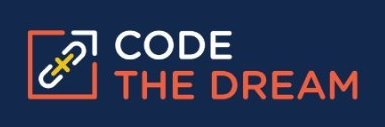

<h2 align="center">Code the Dream</h2>

LifeStyle App

<h4 align="center">Alpaca-Albatross Practicum - Team 3</h4>
<h6 align="center">Back End Repository</h6>

    

## About

This repo is for the Code the Dream, Alpaca-Albatross Practicum - Team 3's development work. Please visit the project's [representative repo](https://github.com/Code-the-Dream-School/alpaca-albatross-practicum-team3-front) for its production code and README.

### Contributors

(https://github.com/Sanlung)
(https://github.com/lis-anna)
(https://github.com/Dahlak76)
(https://github.com/dow-mp)
(https://github.com/Nelly-OP)
(https://github.com/essbee23)

### License

MIT license
